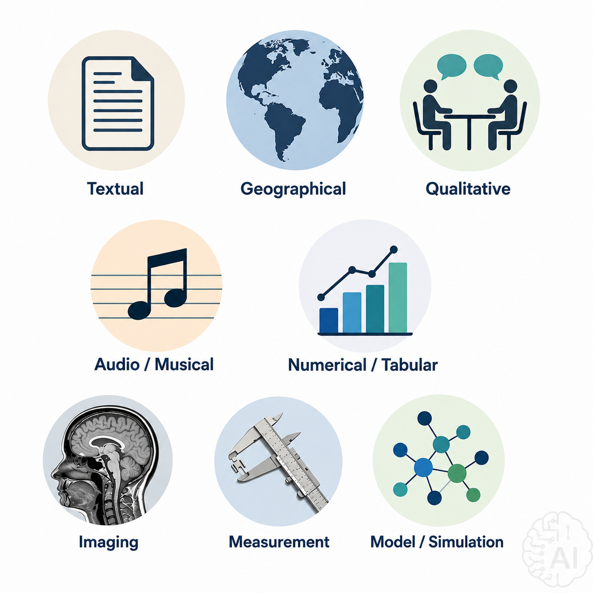
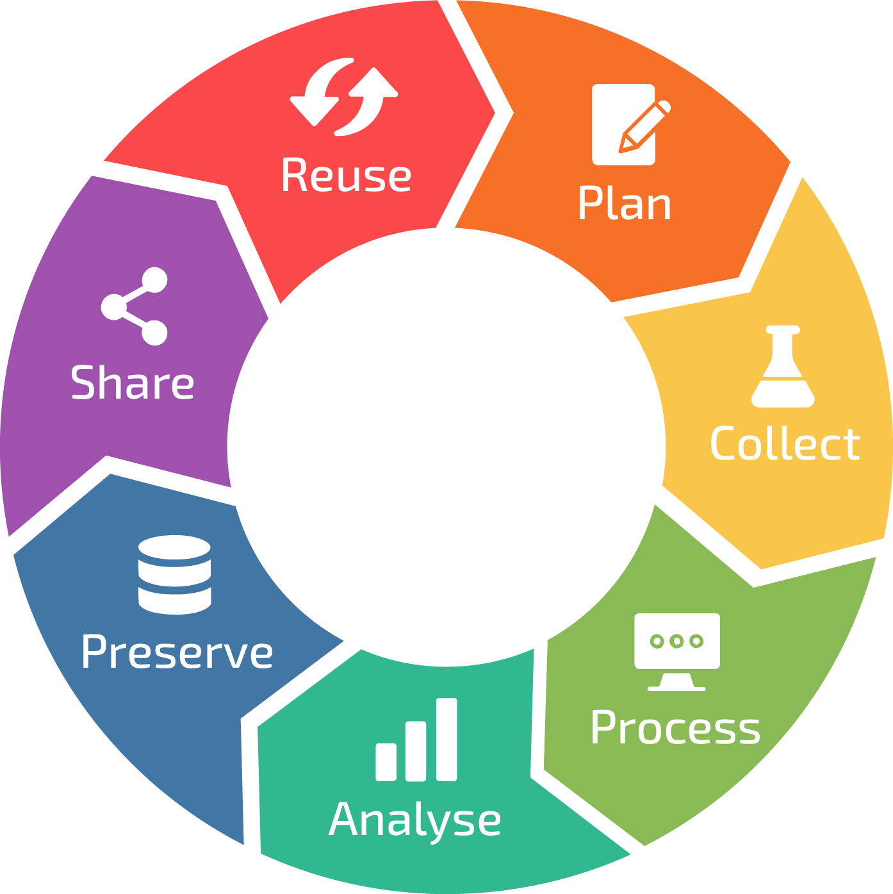
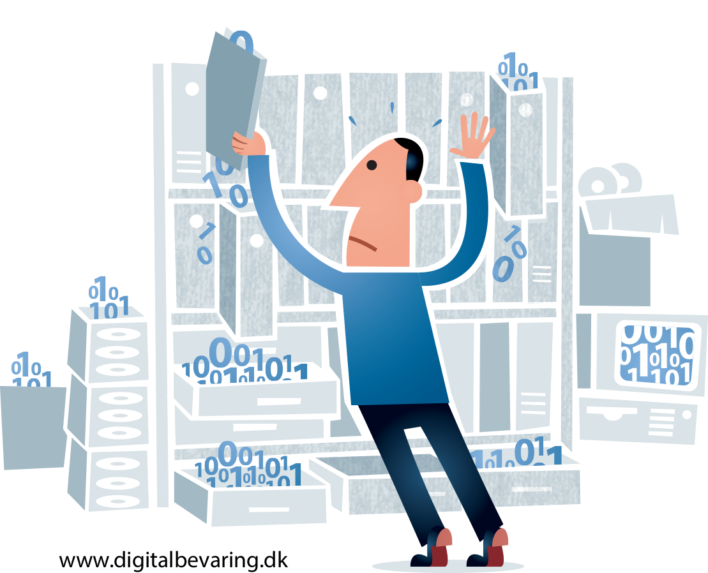
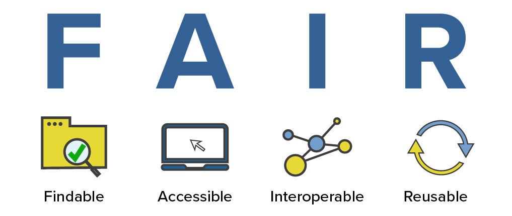
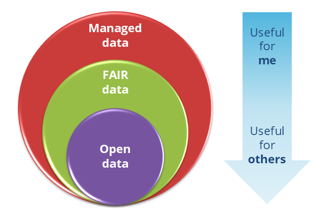

Before we get started with getting into details, let's first agree what we mean
with some key concepts. 

## Data
::: {.columns}
::: {.column width="70%"}
Along your research journey you collect a lot of data, but what do we mean by “data”?

This depends very much on your discipline. It can be images, literature, musical scores, scans, geographical data, interviews, etc. But also tools you create, code you write and analyzed results count as data, which all needs to be “managed”.

:::

::: {.column width="30%"}

{fig-alt="All different types of data"}
:::
:::

## Research Data Lifecycle

::: {.columns}

::: {.column width="70%"}
The research data lifecycle is like a journey that research data takes
from the moment you plan your study and gather information, all the way to storing it safely or deciding what to do with it afterward. 
Think of it as a roadmap that helps researchers keep their data organized, trustworthy, and useful at every step of their project.
:::

::: {.column width="30%"}

{fig-alt="Diagram of the research data lifecycle showing stages from planning to data sharing and preservation."}

::: {.image-source}
Source: @Alper2025RDMkit RDMkit  {width="60px"}
:::
:::
:::

## Research Data Management
::: {.columns}

::: {.column width="70%"}
RDM refers to the active organization and maintenance of data created during a research project. 

It is an ongoing activity throughout the data lifecycle, from initial planning to suitable archiving of the data at the project’s completion.  

If you plan in advance and invest in good (FAIR) data management practices
:::

::: {.column width="30%"}
{fig-alt="Vector image on managing your data"}

::: {.image-source}
Source: Jørgen Stamp (https://digitalbevaring.dk) {width="60px"}
:::
:::
:::

-------------->>>>> link to importance of RDM in intro

## FAIR data
::: {.columns}

::: {.column width="70%"}
After you collect it, you want your data to keep having an impact, even if you move labs.
Therefore the data needs to be usable and understandable by you, but also your research group and preferably you want it to be fit for reuse by other labs. And then the question is: how trustworthy and sharable is your data? 

This is where making your data FAIR comes into play. 
:::

::: {.column width="30%"}
{fig-alt="FAIR data principles diagram showing Findable, Accessible, Interoperable, and Reusable"}

::: {.image-source}
Source: Center for Open Science {width="60px"}
:::
:::
:::

## Open data
::: {.columns}
::: {.column width="70%"}
“Open Data is data that can be freely used, re-used and redistributed 
by anyone subject only, at most, to the requirements to attribute and share-alike ”    
(link to The Open Data Handbook)

The A in FAIR means accessible, but that does not immediately mean that your data needs to be fully open for everybody to use. 
So if there are privacy or patent issues, you can still perform FAIR practices, without having your data openly available.
:::

::: {.column width="30%"}
{fig-alt="Nested circle diagram of Managed data, FAIR data, and Open data, alongside a vertical arrow showing increasing usefulness from “useful for me” to “useful for others.”"}

:::
:::

