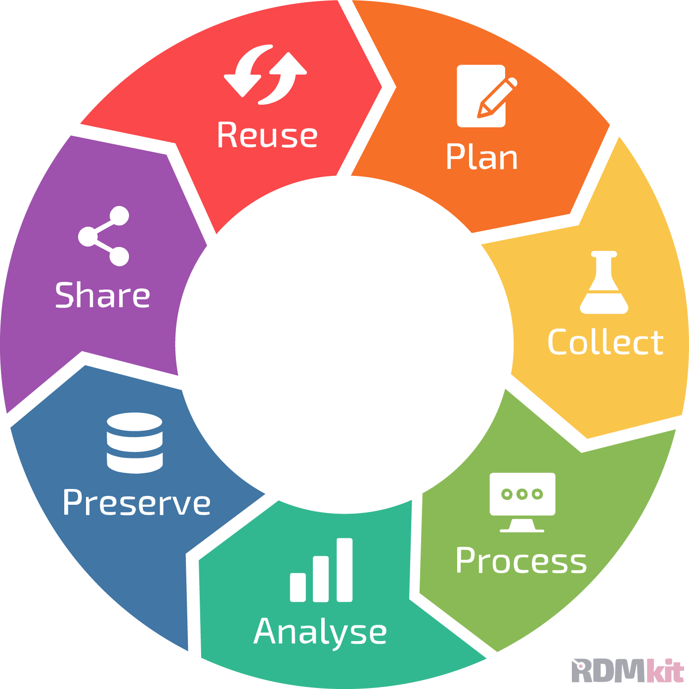
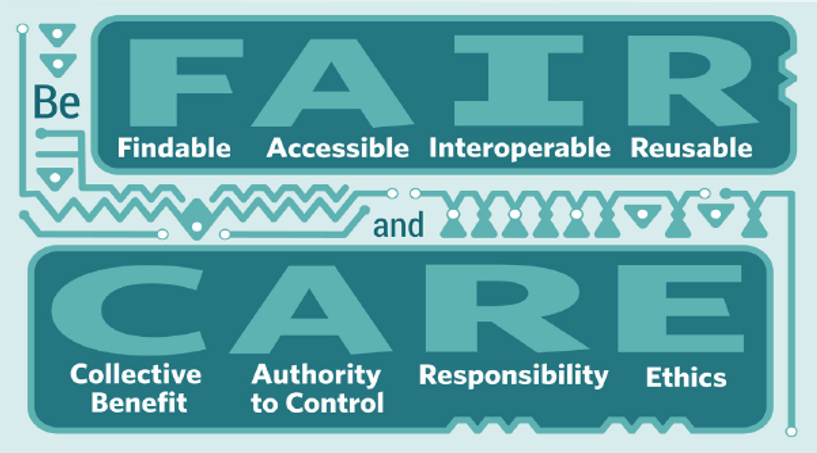

# Outline {.unnumbered}

## Opening

- Instructor Introductions
- Participant Introductions
  - Role & Faculty
  - What brought you to the workshop?

## Data, Data, Data

- What data do you work with? _Note on the whiteboard._
- Definition of (Research) Data
- _Any additions to the whiteboard after the definition / before moving on?_

## Today's Workshop

{width=50%}

We will follow the research data lifecycle to cover the following topics. We will do our best to ensure all the data types you mentioned are covered.

  - _insert topic_
  - _insert topic_

## Definitions

Before getting into the research data lifecycle, we want to address some definitions:

- Research Data Management
- [FAIR Principles](https://www.nature.com/articles/sdata201618)
- [CARE Principles](https://datascience.codata.org/articles/dsj-2020-043)
- Open Data

{width=50%}

## Importance of RDM

Of the definitions we mentioned, our workshop will focus on RDM as an activity. Why is RDM important?

- _insert data horror stories_
- _insert data success stories_